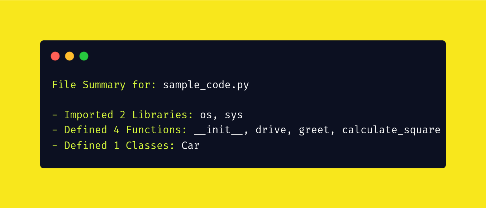

# Source code summarizer using tree-sitter

Summaries a source code file.



## How to run?

### Install dependencies

Install tree-sitter binaries and python library.

```bash
pip install -r requirements.txt
```

### Clone grammar of your choice

Tree-sitter has support for grammars of multiple programming languages. We use
python grammar for this demo. Clone the python grammar using below command,

```bash
git clone https://github.com/tree-sitter/tree-sitter-python
```

### Generate summary of the sample code.

```bash
python -m summarize.py "sample_code.py"
```

You will get a similar response as shown here:

```
File Summary for: sample_code.py

- Imported 2 Libraries: os, sys
- Defined 4 Functions: __init__, drive, greet, calculate_square
- Defined 1 Classes: Car
```

Notes:

- You can modify the tree-sitter queries according to the grammar of a 
particular language. Here, I have shown how to extract `imports`, `functions` and
`classes` using a `CST` generated using the `"sample_code.py"` which can be found at
`"sample_code.cst"` for reference.

- Use tree-sitter-playground to quickly visualize cst generated using parsers.
